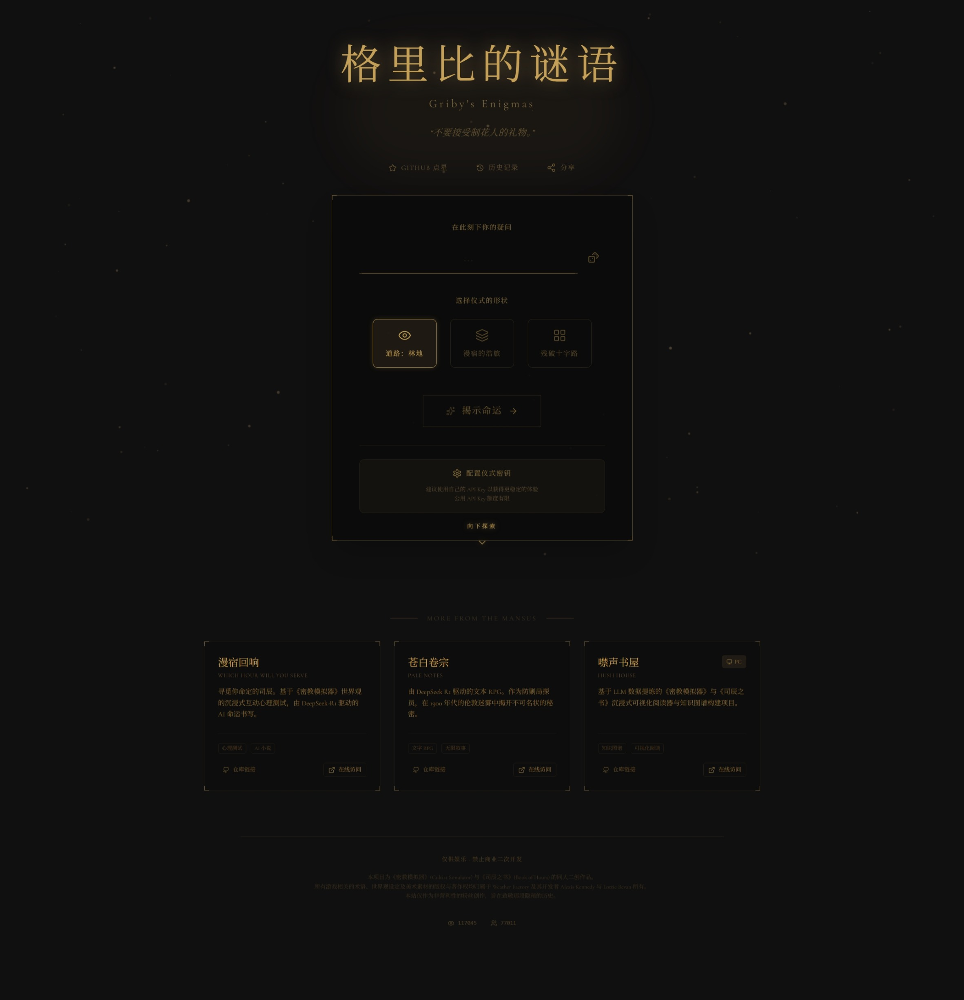
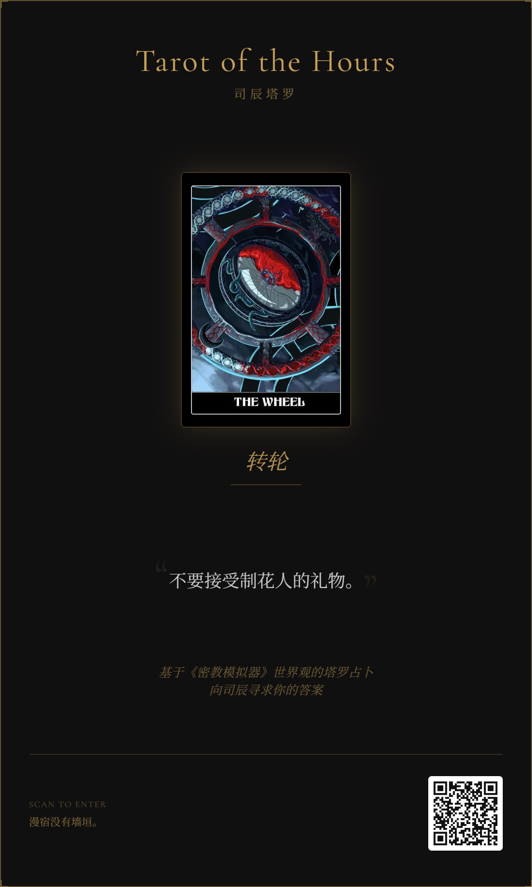
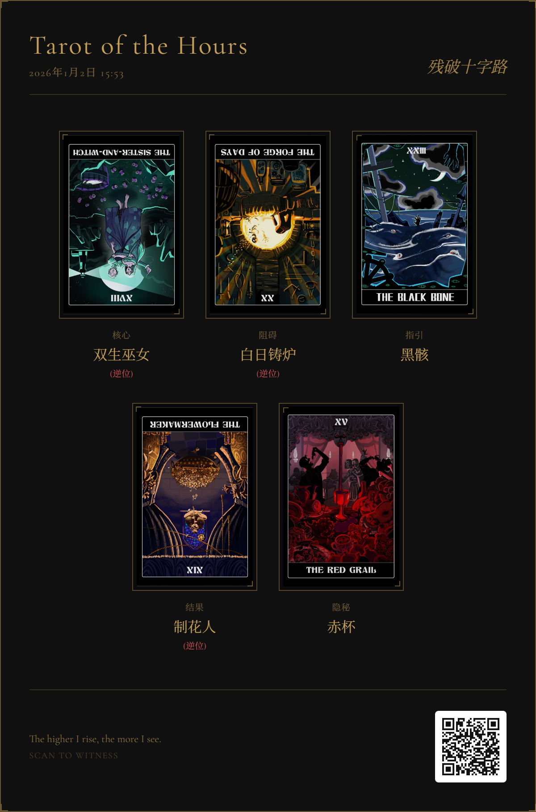

# 🕯️ 司辰塔罗 (Hours Tarot) - 漫宿的低语

> “每一张牌都是一扇门，每一个时刻都是一把钥匙。”

[🔮 **立即开启仪式 (Live Demo)**](https://luyu14039.github.io/tarot-but-hours/reading)

本项目是一个基于 **《密教模拟器 (Cultist Simulator)》** 与 **《司辰之书 (Book of Hours)》** 世界观的沉浸式塔罗占卜体验。在这里，你不再是屏幕前的玩家，而是徘徊在林地边缘的求道者，通过“司辰塔罗”这一媒介，与漫宿（The Mansus）之上的存在进行对话。



## ✨ 核心特性 (Features)

### 1. 司辰的指引 (Guidance of the Hours) 🔮
每一次抽取，都是一次对无形之术的窥探。我们收录了所有司辰的隐秘知识，通过精美的卡面与晦涩的箴言，为您揭示当下的命运。
*   **随机性与宿命**: 在无形的算法中，抽取属于你的“时刻”。
*   **性相解析**: 每一张牌都对应着灯、铸、刃、冬、心、杯、蛾、启等性相，揭示你灵魂深处的渴望或恐惧。

### 2. AI 守密人 (AI Secret Keeper) 🖋️
集成 **DeepSeek-R1 (Reasoner)** 模型，扮演一位居于漫宿之上的守密人。
*   **深度解读**: 不再是通用的塔罗解释，而是结合了神秘学法则的深度分析。AI 会根据你抽到的牌阵（过去、现在、未来），结合性相的生克关系，为你编写一段独一无二的预言。
*   **沉浸式对话**: 守密人将以第二人称与你对话，用充满诗意、隐喻且带有克苏鲁风格的语言，解答你关于“飞升”、“渴望”或“现实困境”的疑惑。


### 3. 仪式留影 (Ritual Sharing) 📸
我们为您准备了精美的分享功能，记录下这灵光一闪的时刻。
*   **精美卡片**: 自动生成包含牌阵、日期、用户提问及专属解读的精美分享卡片。
*   **多种模式**: 
    *   **首页分享**: 分享你今日抽到的司辰与箴言。
    *   **解读分享**: 生成长图，完整记录守密人的教诲。

| 首页分享 | 占卜结果分享 |
| :---: | :---: |
|  |  |

### 4. 极致的视听体验 🎨
*   **流光溢彩**: 基于 **Framer Motion** 的平滑动画与转场，模拟卡牌翻转与灵体浮动的质感。
*   **响应式设计**: 完美适配桌面与移动端，无论是在电脑前还是手机上，都能随时随地开启仪式。
*   **交互细节**: 细腻的 UI 设计，融合了神秘学符号与现代网页美学。


## 🛠️ 技术栈 (Tech Stack)

*   **核心框架**: [Next.js 16](https://nextjs.org/) (React 19)
*   **构建工具**: [Turbopack](https://nextjs.org/docs/architecture/turbopack)
*   **样式**: [Tailwind CSS](https://tailwindcss.com/)
*   **动画**: [Framer Motion](https://www.framer.com/motion/)
*   **状态管理**: [Zustand](https://github.com/pmndrs/zustand)
*   **AI 集成**: DeepSeek API (OpenAI Compatible)
*   **图像生成**: `html-to-image` (用于生成分享卡片)
*   **图标**: `lucide-react`

## 🚀 快速开始 (Quick Start)

如果你想在本地运行此项目，开启属于你的漫宿之旅：

1.  **克隆仓库**
    ```bash
    git clone https://github.com/your-username/tarot-but-hours.git
    cd tarot-but-hours/web
    ```

2.  **安装依赖**
    ```bash
    npm install
    ```

3.  **配置环境变量**
    在 `web` 目录下创建一个 `.env.local` 文件，并填入您的 API Key（推荐使用 DeepSeek）：
    ```env
    NEXT_PUBLIC_API_BASE_URL=https://api.deepseek.com
    NEXT_PUBLIC_API_KEY=your_api_key_here
    ```

4.  **启动仪式**
    ```bash
    npm run dev
    ```
    打开浏览器访问 `http://localhost:3000`。

## 📜 版权与免责声明 (License & Disclaimer)

本项目为 Weather Factory 旗下游戏《密教模拟器》与《司辰之书》的同人二创作品。

*   **世界观与设定**: 归属于 [Weather Factory](https://weatherfactory.biz/)。
*   **图片素材**: 部分素材来源于游戏原作或网络，仅用于非商业交流与学习。
*   **开源说明**: 
    *   本项目代码开源，欢迎大家自由使用、学习或进行二次创作。
    *   严禁用于任何商业用途（包括但不限于付费访问、广告盈利等）。
    *   转载或基于本项目进行修改发布时，请务必保留原作者署名及本项目的 GitHub 链接。

---

*“虽然我们侍奉不同的神，但我们都渴望同一个太阳。”*
